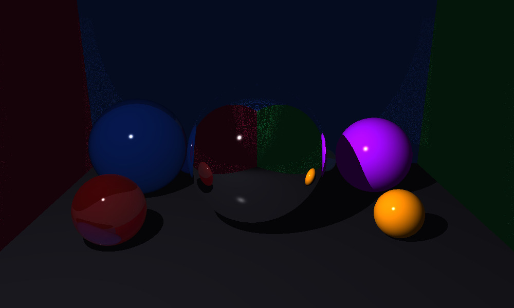
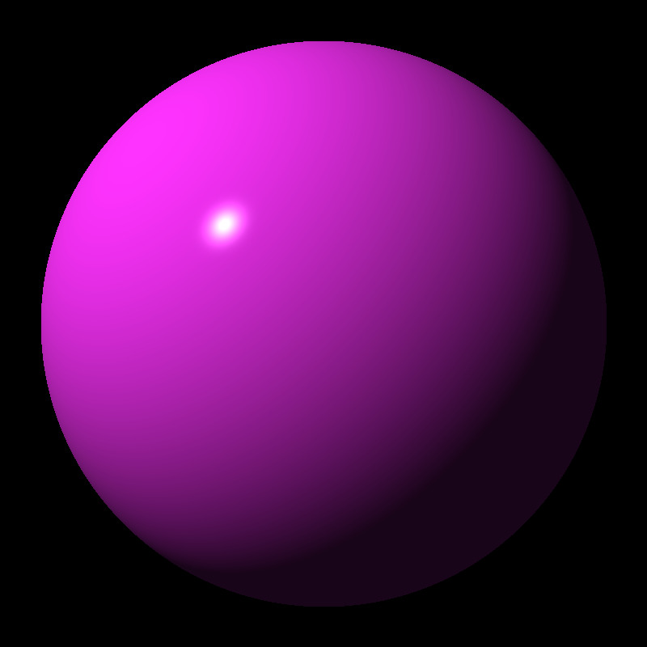
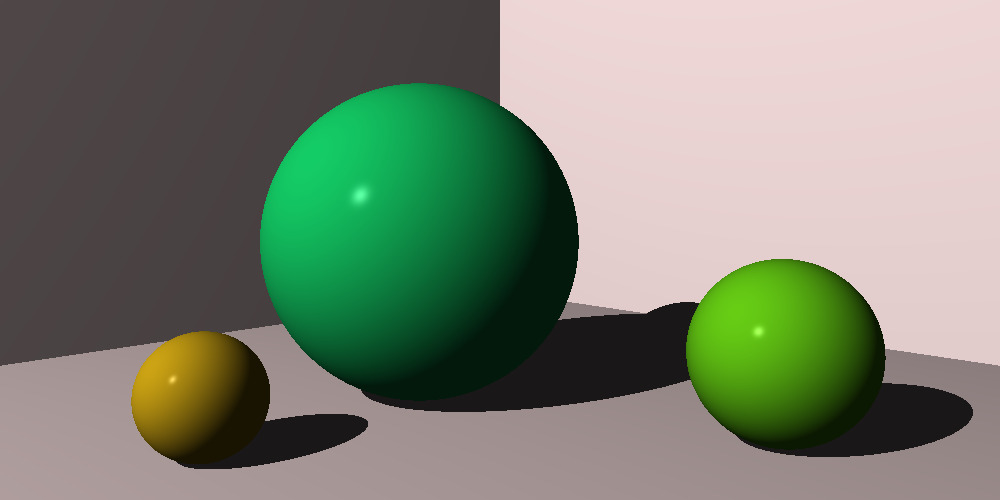
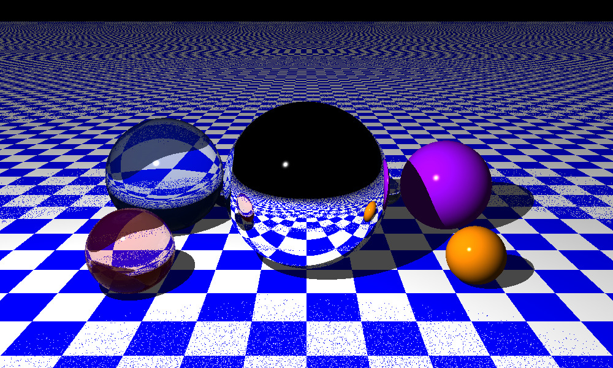
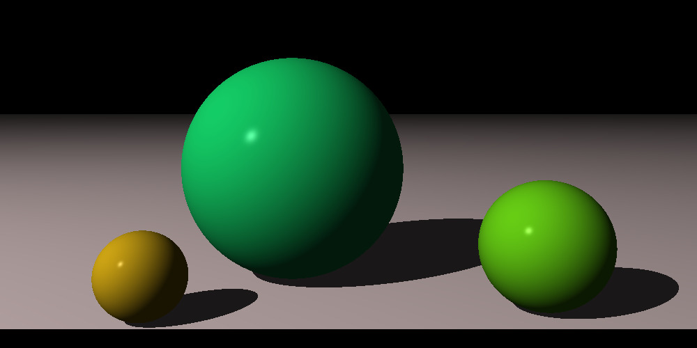
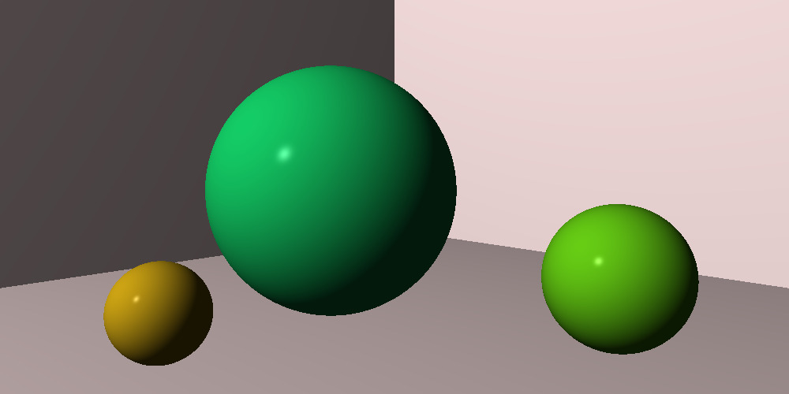
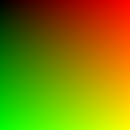

# Ray Tracer Challenge

## English

This project is still under development and is in an early stage.

The goal of this project is to build a ray tracer in Rust without using external libraries, only the Rust standard library.

It is based on the book "The Ray Tracer Challenge" by Jamis Buck and other sources. For more information about how it was built, see [LEARN.md](LEARN.md).

### Run the project

Make sure Rust and Cargo are installed.

```bash
cargo build
cargo run
```

### Run the tests

```bash
cargo test
```

## Español

Este proyecto sigue en desarrollo y se encuentra en una etapa temprana.

El objetivo de este proyecto es construir un ray tracer en Rust sin usar librerías externas, solo la librería estándar de Rust.

Está basado en el libro "The Ray Tracer Challenge" de Jamis Buck y otras fuentes. Para saber más sobre cómo fue construido, consulta [LEARN.es.md](LEARN.es.md).

### Ejecutar el proyecto

Asegúrate de tener Rust y Cargo instalados.

```bash
cargo build
cargo run
```

### Ejecutar los tests

```bash
cargo test
```

## Last IMAGE generated


## Gallery

<table>
  <tr>
    <td align="center">
      <br/>
      <sub>First circle</sub>
    </td>
    <td align="center">
      <br/>
      <sub>First circle with light</sub>
    </td>
    <td align="center">
      <br/>
      <sub>First image with shadow</sub>
    </td>
  </tr>
  <tr>
    <td align="center">
      <br/>
      <sub>Pattern</sub>
    </td>
    <td align="center">
      <br/>
      <sub>Plane</sub>
    </td>
    <td align="center">
      <br/>
      <sub>Reflective surfaces</sub>
    </td>
  </tr>
  <tr>
    <td align="center">
      <br/>
      <sub>Full scene: floor, walls & spheres</sub>
    </td>
    <td align="center">
      <br/>
      <sub>Function image example</sub>
    </td>
    <td align="center">
      <br/>
      <sub>Image example</sub>
    </td>
  </tr>
</table>
